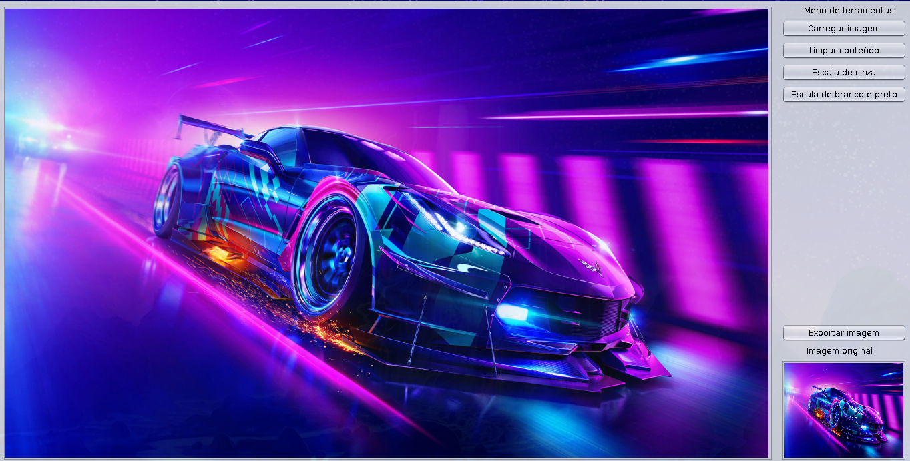
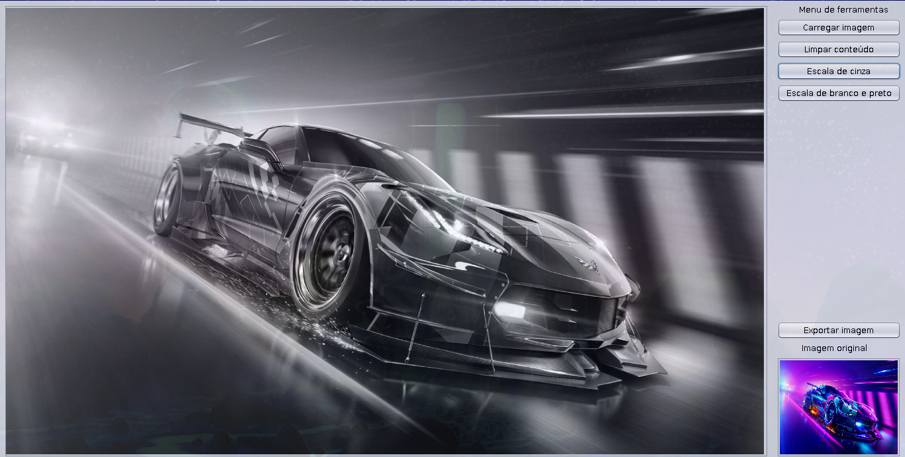
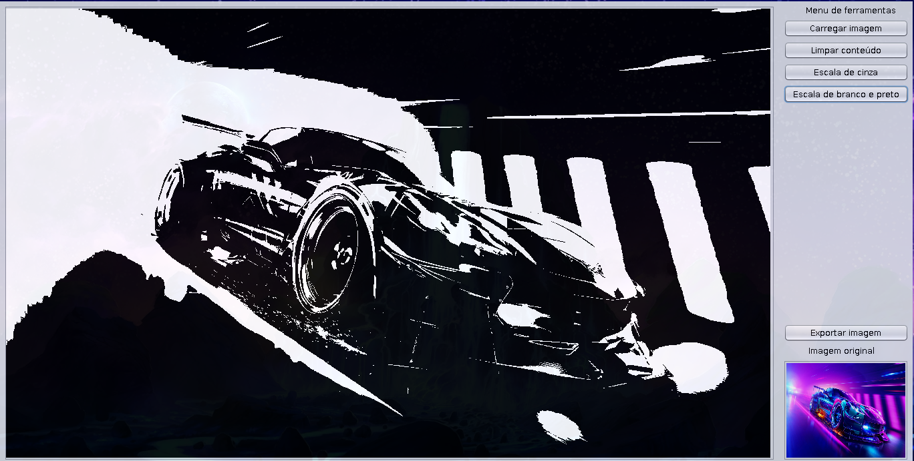
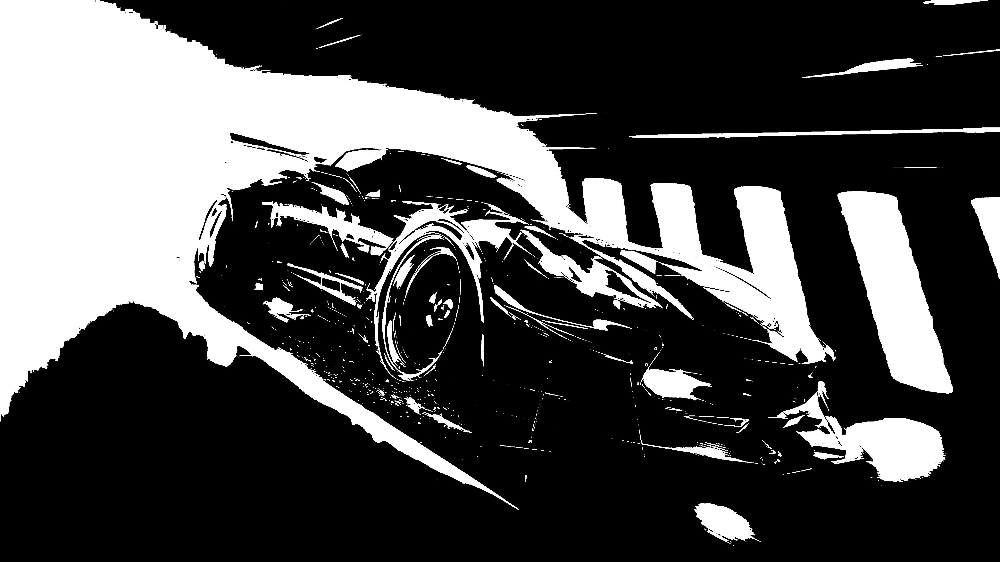

# 256 Tons de cinza

Software de conversão de imagem simplificado.

## Descrição

### Contexto

256 Tons de cinza é um software focado na remoção de canais RGB da imagem para assim transformá-la em escala de cinza.

Além disto, este software também calcula a tonalidade dos pixels da imagem para convertê-la em branco e preto. Neste cenário, os pixels que na escala de cinza forem `< 127` tornar-se-ão **brancos** e `>= 128` tornar-se-ão pretos na imagem.

### Informações essenciais

- Idioma: Português.

- Linguagem: Java.

- Contêm interface gráfica.

- Funciona em ambientes: Linux, MacOS e Windows.

## Funcionalidades

- Importar a imagem do computador.

- Limpar imagem (escolher outra imagem para editar).

- Converter imagem para escala de cinza.

- Converter imagem para branco e preto.

- Exportar imagem.

- Visualizar imagem original em miniatura durante a edição.

- Escolher o nome do arquivo da imagem convertida.

## Instalação

Este software é portátil, ou seja, não há necessidade de instalação e já está pronto para ser executado!

### Dependências

1. Java

### Execução

1. Baixe o arquivo executavél `.jar` na seção `release`.

1. Abra o `terminal` e execute o comando:
    > $ `java -jar ./256_tons_de_cinza.jar`

1. Ou clone o este repositório e execute:
    > $ `java -jar ./dist/256_tons_de_cinza.jar`

1. Aproveite!

## Screenshoots

### Interface do software

- 

- 

- 

### Resultado da exportação

- 

- 
