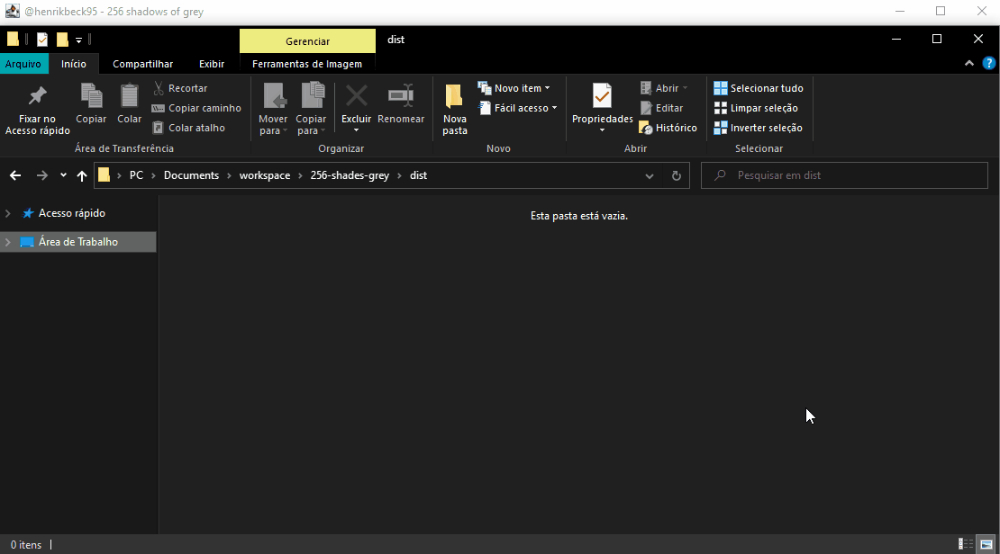
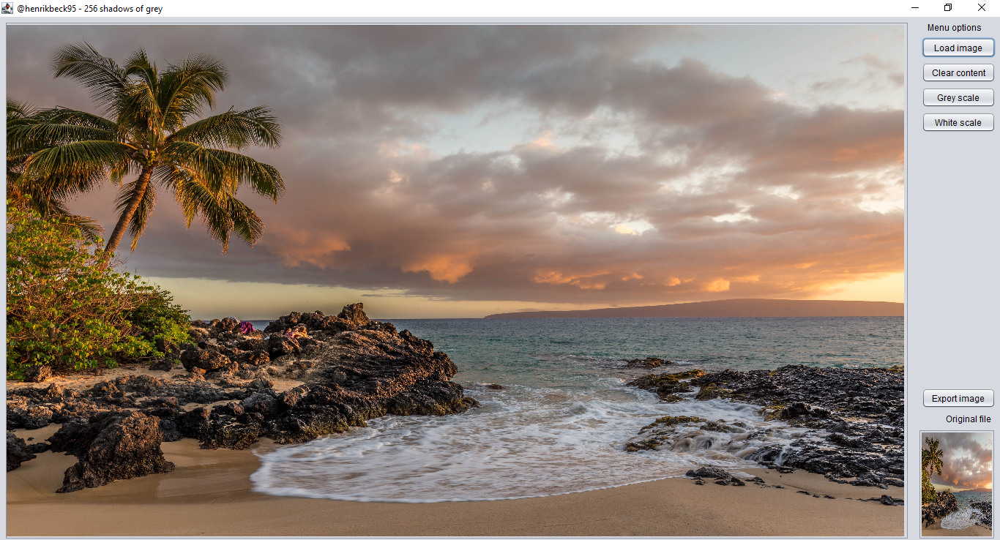

# 256 Shades of Grey

Simple image processor tool for color conversion.

## References

- [Credits to the used picture](https://unsplash.com/photos/DuD5D3lWC3c).

## Description

256 Shades of Grey is a dedicated software for removing RGB channel from file image for converting it to grey and white black scales.

- Essentials information

|Subject            |Info
|---                |---
|Language           |English
|Usage mode         |Graphical User Interface (GUI)
|Operating systems  |Linux, MacOS and Windows

- Features
    1. [x] Load image file from current operating system.
    1. [x] Clear the content (choose another file image for editing it).
    1. [x] Convert image file to grey scale.
    1. [x] Convert image file to white black scale.
    1. [x] Export edited file image.
    1. [x] Preview the original file image as thumbnail while editing.
    1. [x] Choose the file name for exporting the edited file image.

## Installation setup

This is a portable software. No installation setup is required for running it.

### Dependencies

1. Java JRE >= 11.

### Executing

- Open with mouse
    > Just press double click over the file.

- Opening from terminal
    1. Download the executable `.jar` file on `release` section.

    1. Open your `terminal` and execute the following command:
        > $ `java -jar ./256-shades-grey.jar`

    1. Enjoy it!

## Screenshoots

### Usage

<!--
### Software Graphical User Interface (GUI)

- 

- 

- 

- 

- 

- 

### Exporting result

- 

- 
-->